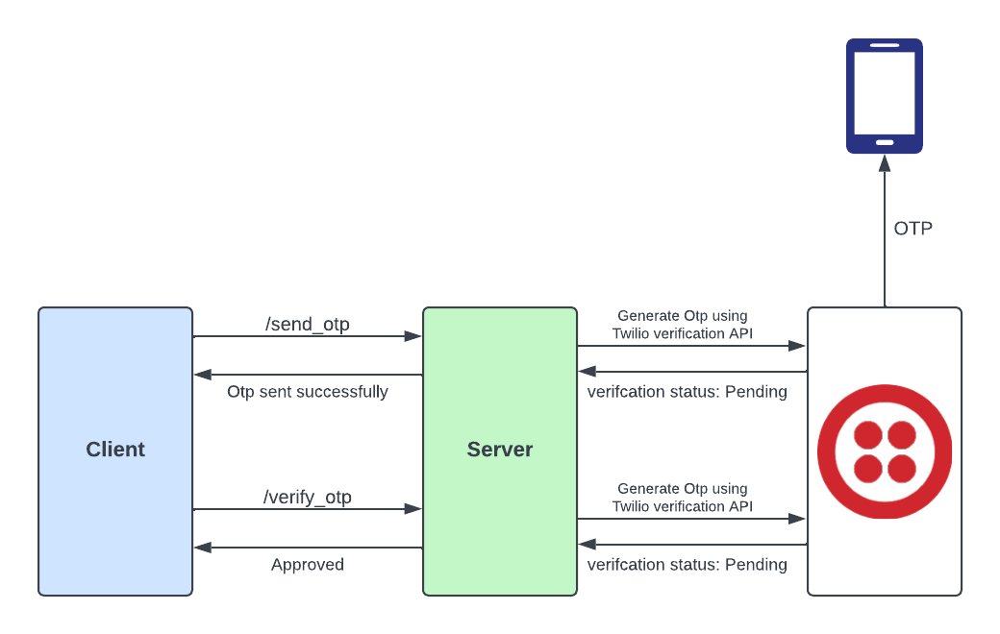

<div align="center">
<p style="display; ">
  <a href="http://nestjs.com/" target="blank"></a>
  <a href="http://nestjs.com/" target="blank"></a>
</p>
</div>

  <h1 align="center"> OTP Verification Backend App: Powered by <a href="http://nestjs.com/" target="_blank">Next.js</a> and <a href="https://www.twilio.com/docs/messaging" target="_blank">Twilio </h1>
    <p align="center">
      <a href="https://www.npmjs.com/~nestjscore" target="_blank"></a>
      <a href="https://www.npmjs.com/~nestjscore" target="_blank"></a>
      <a href="https://twitter.com/mishras85003094" target="_blank"></a>
      <a href="https://twitter.com/mishras85003094" target="_blank"></a>
      <a href="https://twitter.com/mishras85003094" target="_blank"></a>
      <a href="https://twitter.com/mishras85003094" target="_blank"></a>
      <a href="https://twitter.com/mishras85003094" target="_blank"></a>
      <a href="https://twitter.com/mishras85003094" target="_blank"></a>
    </p>

## Description

Implement a secure OTP verification feature seamlessly with our Backend App, powered by [Next.js](http://nestjs.com/) and [Twilio](https://www.twilio.com/docs/messaging) Integration. Elevate user authentication on your website or app by integrating our reliable solution, ensuring a streamlined and secure verification process. Boost the trust and security of your platform effortlessly.



## Table of Contents

1. [Installation](#installation)
2. [Twilio Setup](#twilio-setup)
3. [Usage](#usage)
4. [Endpoints](#endpoints)
5. [License](#license)

## Installation

#### Clone the repository

```bash
$ git clone https://github.com/TonyStark0801/Otp-verification.git
```

#### Install dependencies

```bash
$ npm install
```

## Twilio Setup

To enable OTP functionality using Twilio in this project, follow these steps:

### 1. Create a Twilio Account

If you don't have a Twilio account, sign up for one at [Twilio](https://www.twilio.com/).

### 2. Obtain Twilio API Credentials

Once logged in, navigate to the [Twilio Console](https://www.twilio.com/console) to obtain your Account SID, Auth Token, and a Twilio phone number.

### 3. Create an SMS Service

In the Twilio Console, create a new Verify service:

- Navigate to [Verify > Services](https://www.twilio.com/console/verify/services).
- Click on "Create a new Service" and follow the prompts.
- Note the Service SID once the service is created.

### 4. Configure Environment Variables

In your project, create or update your environment variables file (e.g., `.env`) and add the following Twilio credentials:

```env
TWILIO_ACCOUNT_SID=your_account_sid
TWILIO_AUTH_TOKEN=your_auth_token
TWILIO_PHONE_NUMBER=your_twilio_phone_number
```

## Usage

```bash
# development
$ npm run start

# watch mode
$ npm run start:dev

# production mode
$ npm run start:prod
```

## Endpoints

1. **Send OTP**

   - Endpoint: `/auth/send_otp`
   - Description: Sends a One-Time Password (OTP) to the user's registered phone number for authentication.
   - Method: POST
   - URL: `http://localhost:3000/auth/send_otp`
   - Request Body: JSON format with the user's phone number.

     ```json
     {
       "phone": "9445xxxxxx"
     }
     ```

   ### Response

   #### Successful Response (HTTP 201 CREATED)

   ```json
   {
     "message": "OTP sent successfully.",
     "VerificationStatus": "pending"
   }
   ```

2. **Verify OTP**

   - Endpoint: `/auth/verify_otp`
   - Description: Verify the provided OTP against the sent OTP for the user's phone number.
   - Method: POST
   - URL: `http://localhost:3000/auth/verify_otp`
   - Request Body: JSON format with the user's phone number and the entered OTP.

     ```json
     {
       "phone": "9445xxxxxx",
       "otp": "123456"
     }
     ```

   ### Response

   #### Successful Response (HTTP 201 CREATED)

   ```json
   {
     "VerificationStatus": "approved"
   }
   ```

## Stay in touch

- Author - [Shubham Mishra](https://www.linkedin.com/in/shubhammishra8149/)
- Twitter - [@shubhamMishra](https://twitter.com/mishras85003094)

## License

This project is licensed under the MIT License - see the [LICENSE](LICENSE) file for details.
